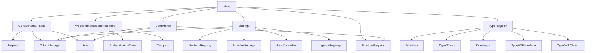

# Project Architecture & Codebase Structure

This document provides a high-level overview of the architecture, directory structure, and key dependencies of the `wp-graphql-headless-login` project. It is designed to help both human and autonomous agents quickly understand, extend, and troubleshoot the codebase. **If you are an agent, read this before making architectural changes.**


## High-Level Architectural Pattern

**Pattern:** Layered Monolith with Modular Components

- The plugin is organized into logical namespaces and directories (e.g., `Admin`, `Auth`, `Model`, `Type`, `Utils`).
- Core plugin logic is encapsulated in a singleton (`Main` class) that initializes all major subsystems.
- Schema and type registration is handled via dedicated registry classes.
- Extensibility is achieved through WordPress hooks, filters, and modular class design.

## Key Extension Points (For Agents)

- **Authentication Providers:** To add a new provider, subclass `AbstractProviderType` in `src/Providers/ProviderType/`, implement required schema and authentication methods, and register it in the provider registry.
- **GraphQL Schema:** Add or modify fields/types via `CoreSchemaFilters.php`, `WoocommerceSchemaFilters.php`, or by extending the `TypeRegistry`.
- **Admin UI/Settings:** Extend `src/Admin/Settings.php` for new settings or UI components. Use WordPress hooks for integration.
- **User Profile:** Add user identity fields or actions in `src/Admin/UserProfile.php`.

## Troubleshooting & Anti-Patterns (For Agents)

- **Do not duplicate provider logic:** All provider-specific logic must live in the ProviderType subclass, not in Model or Client.
- **Avoid tight coupling:** Do not hardcode provider types or schema fields outside their dedicated classes.
- **Batch operations:** When validating or sanitizing provider options, always use the batch methods on ProviderType, not per-field logic in Model.
- **Schema changes:** Always update the TypeRegistry and relevant schema filter files when adding new types or mutations.
- **If you encounter ambiguous logic or unclear extension points, escalate as per AGENT_CONSTITUTION.md.**


## Directory Structure (Key Folders)

```
wp-graphql-headless-login/
├── src/
│   ├── Admin/           # Admin UI, settings, user profile integration
│   ├── Auth/            # Authentication providers, token management
│   ├── Fields/          # GraphQL field definitions
│   ├── Model/           # Data models (User, Client, etc.)
│   ├── Mutation/        # GraphQL mutations
│   ├── Type/            # GraphQL types, enums, interfaces
│   ├── Utils/           # Utility functions
│   ├── CoreSchemaFilters.php
│   ├── WoocommerceSchemaFilters.php
│   ├── Main.php
│   ├── TypeRegistry.php
│   └── Autoloader.php
├── assets/              # Images and plugin assets
├── build/               # Compiled JS/CSS assets
├── tests/               # Codeception and WP-Browser tests
├── vendor/              # Composer dependencies
├── .github/workflows/   # CI/CD workflows
├── package.json         # Node dependencies and scripts
├── composer.json        # PHP dependencies and scripts
└── ...
```

## Key Module & Component Interactions




- **Main**: The entry point, initializes all major subsystems and hooks.
- **CoreSchemaFilters/WoocommerceSchemaFilters**: Register GraphQL schema modifications and integrations.
- **Settings/UserProfile**: Register admin UI, settings, and user profile fields.
- **TypeRegistry**: Registers all GraphQL types, enums, interfaces, and mutations.

## Quick Reference for Agents

- **To add a provider:** Subclass `AbstractProviderType`, implement required methods, and register.
- **To update schema:** Use `TypeRegistry` and schema filter files.
- **To add admin UI:** Extend `Admin/Settings.php` and use hooks.
- **To troubleshoot:** Check for logic duplication, coupling, and batch operation usage. Escalate if unclear.

## Dependency Graph (PHP Namespaces)

- `WPGraphQL\Login\*` (core plugin logic)
- `WPGraphQL\Login\Admin\*` (admin UI/settings)
- `WPGraphQL\Login\Auth\*` (auth providers, tokens)
- `WPGraphQL\Login\Model\*` (data models)
- `WPGraphQL\Login\Type\*` (GraphQL types)
- `WPGraphQL\Login\Mutation\*` (GraphQL mutations)
- `WPGraphQL\Login\Utils\*` (utilities)

---

---

**This document must be updated if you change architecture, extension points, or encounter new anti-patterns.**
